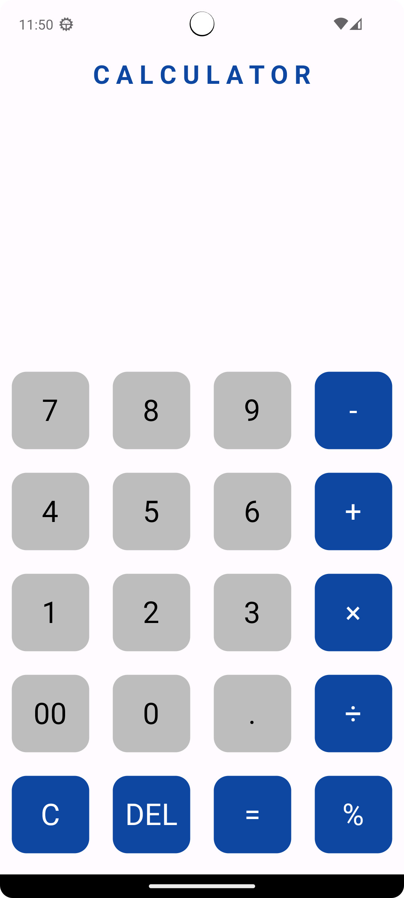
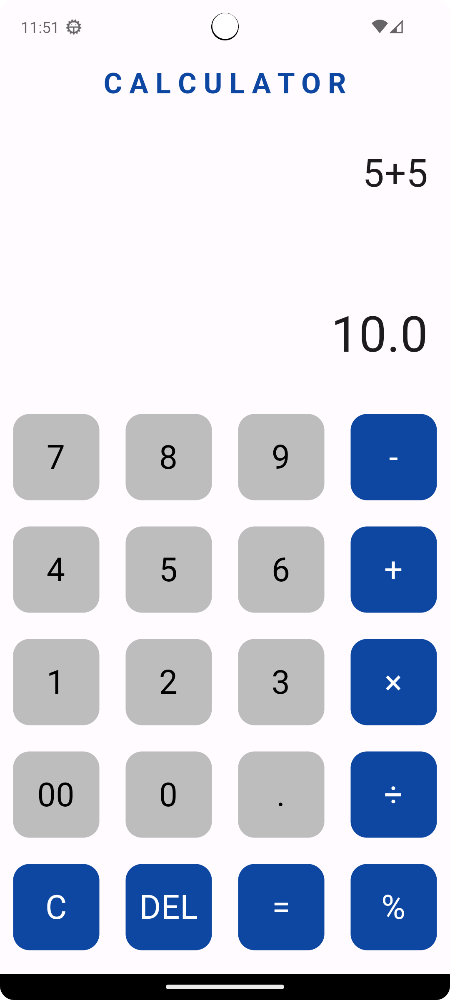
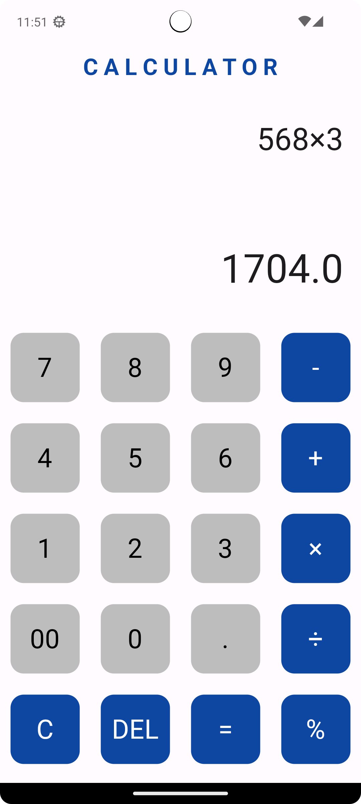

# training_project_for_practice

# Описание проекта

**Обучающий проект калькулятора, создавался для практики и тренировки. Фрэймворк Flutter**

|            Главное меню             |            Операция сложения            |           Операция умножения            |
|:-----------------------------------:|:---------------------------------------:|:---------------------------------------:|
|  |  |  |